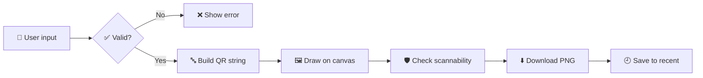

<div align="center">


### 🔳 Make scannable, beautiful QR codes in seconds. No backend, no sign-up.

[](https://qr-generator-finnickyweeb.vercel.app/)
[](https://github.com/FinnickyWeeb/qr-generator)


🎓 Built for **GDG on Campus, SRM Recruitments 2026-27** · 💻 Technical Domain · Frontend Task 1

🌐 **https://qr-generator-finnickyweeb.vercel.app/**

</div>

---

## 📑 Table of Contents

- [📸 Screenshots](#-screenshots)
- [✨ Features](#-features)
- [⚙️ How It Works](#️-how-it-works)
- [🛠️ Tech Stack](#️-tech-stack)
- [🚀 Run Locally](#-run-locally)
- [🗂️ Project Structure](#️-project-structure)
- [🧪 Testing Checklist](#-testing-checklist)
- [🧠 Design Decisions](#-design-decisions)

---

## 📸 Screenshots

| 🖥️ Desktop | 📱 Mobile |
|:---:|:---:|
|  |  |

| 📶 Wi-Fi QR | ⚠️ Scan Warning | 🕘 Recent Codes |
|:---:|:---:|:---:|
|  |  |  |

---

## ✨ Features

| | Feature | What it does |
|:---:|---|---|
| 🔗 | **5 QR types** | URL, Plain Text, Email, Phone Number and Wi-Fi, each with its own inputs. |
| ⚡ | **Live preview** | The QR code redraws instantly on every change. |
| 🎛️ | **Customization** | Size, code color, background color, error correction (L/M/Q/H) and margin. |
| 🎨 | **Presets** | Classic, Ocean, Forest, Berry and Ember. Everything stays editable afterwards. |
| ⬇️ | **PNG download** | Taken from the same canvas as the preview, so they always match. |
| ✅ | **Validation** | Clear errors for empty or invalid input (bad URL, invalid email, short Wi-Fi password and more). |
| 🛡️ | **Scan reliability** | Warnings for low contrast, inverted colors, tiny margin, small size, dense content and low error correction. |
| 🕘 | **Recent codes** | Saved in `localStorage`, they survive a refresh and can be restored with one click. |
| 📋 | **Copy to clipboard** | Copy the QR image straight from the app. |
| 🌗 | **Dark / light theme** | Follows your system setting automatically. |
| 📱 | **Responsive** | Works on phones, tablets and desktops. |

> [!TIP]
> Want a code that scans every time? Keep contrast above **4:1**, use a dark code on a light background, and leave a margin of at least **2 to 4 modules**.

---

## ⚙️ How It Works



1. 🔤 **Build the data.** `build()` validates the form and creates the string that goes inside the QR:
   - 🔗 URL: `https://example.com`
   - ✉️ Email: `mailto:name@example.com?subject=...&body=...`
   - 📞 Phone: `tel:+919876543210`
   - 📶 Wi-Fi: `WIFI:T:WPA;S:NetworkName;P:password;;` (special characters are escaped)
2. 🖼️ **Draw the preview.** A `useEffect` calls `QRCode.toCanvas` whenever the data or style changes.
3. 🛡️ **Check scannability.** `warnings()` calculates the WCAG contrast ratio between the two colors and checks margin, size, content length and error correction. Warnings appear under the preview and never block a download.
4. 💾 **Download and save.** `canvas.toDataURL('image/png')` creates the PNG. The entry goes into `localStorage` (up to 8, newest first, duplicates removed) along with a small thumbnail.

---

## 🛠️ Tech Stack

| Tool | Purpose |
|---|---|
| ⚛️ **React + Vite** | UI and fast dev/build tooling |
| 🔳 **[qrcode](https://www.npmjs.com/package/qrcode)** | QR generation onto a canvas |
| 🎨 **Plain CSS** | CSS variables, grid, `prefers-color-scheme` |
| ▲ **Vercel** | Deployment |

---

## 🚀 Run Locally

```bash
git clone https://github.com/FinnickyWeeb/qr-generator.git
cd qr-generator
npm install
npm run dev
```

Then open 👉 http://localhost:5173

📦 Production build: `npm run build`

---

## 🗂️ Project Structure

```
qr-generator/
├── 📁 public/
├── 📁 screenshots/       # images used in this README
├── 📁 src/
│   ├── 📄 App.jsx        # UI, validation, QR building, warnings, recent codes
│   ├── 🎨 App.css        # styles
│   ├── 🎨 index.css
│   └── 📄 main.jsx
├── 📄 index.html
└── 📄 package.json
```

---

## 🧪 Testing Checklist

- [x] 🔗 URL: valid, no scheme (`example.com`), invalid text, empty
- [x] 📝 Text: normal, empty, very long (error shown)
- [x] ✉️ Email: valid, invalid, with subject and message
- [x] 📞 Phone: valid with `+`, spaces and dashes, too short, letters
- [x] 📶 Wi-Fi: WPA, WEP, no password, hidden network, short WPA password
- [x] 🎛️ Every customization option updates the preview immediately
- [x] 🎨 Presets apply and colors can be edited afterwards
- [x] ⚠️ Low contrast, inverted colors and small margin each show a warning
- [x] ⬇️ Downloaded PNG matches the preview and scans with a phone
- [x] 🕘 Recent codes persist after refresh, can be reused and cleared
- [x] 📱 Layout works on mobile (375px) and desktop

---

## 🧠 Design Decisions

- 🔒 **No backend.** Everything runs client-side, so no data ever leaves the browser.
- ⚠️ **Warn, don't block.** Risky style choices show a warning but still work, so users keep control.
- 🎯 **One canvas for preview and download.** This guarantees the PNG matches what the user sees.
- 📐 **Margin is measured in modules** (the small squares of a QR code), the unit the `qrcode` library uses.

---

<div align="center">

### 👨‍💻 Created by **Pratham Sharma**

🆔 RA2511003010250 · 🎓 2nd Year CSE Core

🏫 SRM Institute of Science and Technology

⭐ If you liked this project, drop a star on the repo!

</div>